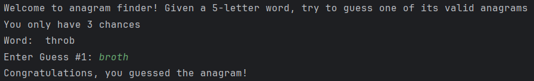

## Python Word Games

A collection of guess-the-word games that run in your terminal.

### The Games

1.  **Classic Wordle**: Guess the 5-letter English word.
2.  **Guess the Fruit**: Guess the name of the fruit (various lengths).
3.  **Word Scramble**: Restore the correct order of a shuffled common English word using its definition as a hint.
4.  **Anagram Finder**: Given a 5-letter word, try to guess one of its valid anagrams—there may be several correct answers.
5.  **Missing Letters**: Given a 6-letter word with 2 random letters missing, guess the original form

### Gameplay Example
Guess the Fruit:


Anagram Finder: 



### Rules & Colors

After you type a guess, the letters will change color:

  * 🟩 **Green:** Correct letter, correct spot.
  * 🟨 **Yellow:** Correct letter, wrong spot.
  * ⬜ **Grey:** Letter is not in the word.

-----

### Requirements
- Python 3.6 or higher

### How to Run
1. Clone the repository (or download as ZIP and extract it):
   ```bash
   git clone https://github.com/Adela44/python-word-games.git
2. Navigate to the game folder, for example:
   ```bash
   cd python-word-games/word_scramble
3. Run the game:
   ```bash
   python word_scramble.py
-----

*Have fun guessing\!*